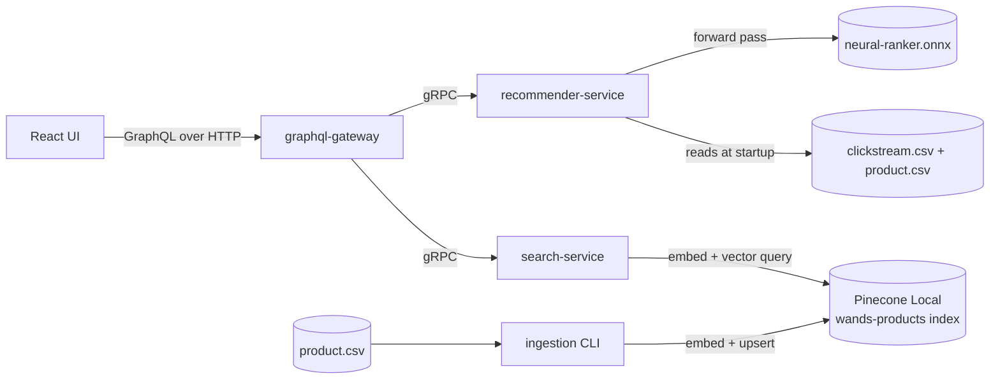

# Recommendation Engine

A React + GraphQL recommendation engine over the [WANDS](https://github.com/wayfair/WANDS)
(Wayfair) furniture catalog. Sibling portfolio project to
[`search`](https://github.com/avantiwhenever/search) (hybrid lexical/semantic
search over the same catalog) — this one explores a different backend stack
(Pinecone instead of self-hosted Elasticsearch) and a different problem
(personalized re-ranking/recommendation strategies instead of retrieval
quality), built with hexagonal architecture and gRPC-only inter-service
communication throughout.

> **Status**: actively being built. See [docs/PROJECT_STATE.md](docs/PROJECT_STATE.md)
> for exactly what's verified-working vs. in progress, and for anyone
> (human or AI) picking this project up without prior context.

## Reading this README

This page serves a few different readers. Pick the path that fits — each is
short and self-contained, no need to read the others first.

<details>
<summary><strong>I'm a recruiter / skimming this — what is it? (30 seconds)</strong></summary>

A full-stack, working recommendation engine: a React search UI, a GraphQL
API layer, three backend microservices written in Java, a real vector
database, and a machine-learning model trained from scratch — all built by
one person, all actually runnable on a laptop with one command
(`docker compose up`), no cloud account needed.

It searches a real furniture catalog (43,000 products) and can switch
between five different recommendation strategies live — including one
backed by a neural network the author trained, tested, and caught a bug in
before trusting its results (see below). It's paired with a sibling search
project ([`search`](https://github.com/avantiwhenever/search)) that takes a
different, more classic approach to the same catalog, for comparison.

</details>

<details>
<summary><strong>I'm a technical hiring manager — what does this actually demonstrate? (2 minutes)</strong></summary>

Concrete, verifiable engineering signal, not a tutorial-follow-along project:

- **System design under real constraints**: hexagonal architecture
  enforced across three Java services, gRPC as the only inter-service
  protocol, GraphQL confined to a single frontend-facing gateway — a
  deliberate architectural discipline, not whatever a framework defaulted
  to. See [docs/ARCHITECTURE.md](docs/ARCHITECTURE.md).
- **Real debugging, documented honestly, not hidden**: this project's
  [docs/PROJECT_STATE.md](docs/PROJECT_STATE.md) is a running log of actual
  problems found and fixed — a vector-DB client library incompatible with
  its local emulator (root-caused via bytecode inspection with `javap`, not
  guesswork), an out-of-memory crash under real load (root-caused and
  fixed, not worked around), a missing CORS config that silently broke the
  frontend (found via live testing, not caught by any test suite), and
  several real HIGH-severity CVEs caught by this project's own CI pipeline
  and fixed with version research, not suppressed.
- **ML work with real rigor, not a black box**: the neural ranking
  strategy's training pipeline (`training/`) initially produced a
  suspiciously perfect result — the author tracked it down to two genuine
  data-leakage bugs, fixed both, and reported the honest (lower, real)
  number afterward. See `training/TRAINING.md`.
- **Production-adjacent engineering hygiene**: CI with dependency/image
  vulnerability scanning, SAST, secret scanning, and Dependabot (all
  actually catching and fixing real findings during development, not just
  configured and forgotten); tests at every layer (pure unit, in-process
  gRPC integration, real end-to-end against live infrastructure);
  Dockerized everything with a documented local-first, cloud-optional path.
- **Grounded in the literature, not vibes**: every recommendation strategy
  cites the specific arxiv paper(s) it's based on — see "arxiv grounding"
  below.

</details>

<details>
<summary><strong>I'm reviewing this codebase — where do I start?</strong></summary>

Go straight to [docs/ARCHITECTURE.md](docs/ARCHITECTURE.md) — it's a
reviewer-oriented tour with a suggested reading order, a map of where the
hexagonal layers live on disk, and what's tested at which layer. Come back
to this README for the "why" behind specific decisions (table below) and
[HOWTO.md](HOWTO.md) to actually run it.

</details>

## Why this project

Most "recommendation engine" portfolio projects are a single service with a
hardcoded ranking formula. This one is built to demonstrate three things
most such projects skip:

1. **A real architectural discipline** — hexagonal (ports & adapters)
   throughout, with gRPC as the only inter-service protocol and GraphQL
   confined to the single frontend-facing edge, so the domain/business logic
   in every service is testable without Spring, without a network, and
   without Docker.
2. **Recommendation strategies grounded in actual literature**, not
   invented — see "arxiv grounding" below — including a from-scratch-trained
   ONNX neural ranking model, not just heuristics.
3. **A fully local, account-free path to running the whole thing** —
   Pinecone Local (a real Docker-based emulator, not a mock) means
   `docker-compose up` gets you a working vector-search-backed system with
   no cloud account, no API key, and no cost, while staying a config change
   away from a real hosted Pinecone index.

## Key decisions

| Decision | Choice | Why |
|---|---|---|
| Dataset | [WANDS](https://github.com/wayfair/WANDS) furniture catalog + a synthetic clickstream | Same real catalog/queries as the sibling `search` project; clickstream is fabricated (documented honestly, see [avantiwhenever/WANDS `CLICKSTREAM.md`](https://github.com/avantiwhenever/WANDS/blob/main/CLICKSTREAM.md)) since WANDS ships no behavioral data, and the recommendation strategies need implicit feedback to train on. |
| Architecture | Hexagonal (ports & adapters) in every Java service | `domain`/`application`/`port` packages have zero framework imports — testable without Spring, gRPC, or a network. A deliberate, explicit constraint on this project, not an emergent pattern. |
| Inter-service protocol | gRPC only between Java services | No REST anywhere except the single GraphQL/HTTP edge the frontend talks to. Shared `.proto` contracts in `proto/` are the real "ports" between services. |
| Frontend protocol | GraphQL, exactly one gateway | `graphql-gateway` is the only service with an inbound HTTP adapter; everything downstream is gRPC. |
| Vector store | Pinecone, via **Pinecone Local** for development | A real Docker-based Pinecone emulator (`ghcr.io/pinecone-io/pinecone-local`) — no account/API key needed to run the full stack locally; pointing at a real hosted Pinecone free-tier index later is a config change (`PINECONE_HOST`/`PINECONE_API_KEY`), not a code change. Not persistent and capped at 100K vectors — a documented dev/demo tradeoff, not a production claim. |
| Embeddings | `bge-small-en-v1.5` via ONNX Runtime, client-side | Pinecone Local has no server-side integrated inference, so embeddings are generated in-process — the one piece ported directly from the sibling `search` project, since it's self-contained (no Spring, no Elasticsearch). |
| Recommendation strategies | Popularity, collaborative-filtering, bandit-exploration, ONNX neural ranker | Each traceable to a specific arxiv paper — see below — rather than an arbitrary re-ranking heuristic. |
| Build tool | Maven, multi-module reactor | Same rationale as the sibling `search` project: declarative dependency graphs are easy for a reviewer to skim. |
| Java version | JDK 26 | Matches the sibling `search` project's choice — latest available toolchain. |

## arxiv grounding

Recommendation strategies are each tied to real recommender-systems
literature, not invented ad hoc:

- [A Survey of Real-World Recommender Systems: Challenges, Constraints, and Industrial Perspectives](https://arxiv.org/abs/2509.06002) (arXiv:2509.06002) — candidate-generation-then-rerank architecture grounding
- [Ranking in Contextual Multi-Armed Bandits](https://arxiv.org/abs/2207.00109) (arXiv:2207.00109) — basis for the bandit exploration strategy
- [BanditMF: Multi-Armed Bandit Based Matrix Factorization Recommender System](https://arxiv.org/abs/2106.10898) (arXiv:2106.10898)
- [Online Interactive Collaborative Filtering Using Multi-Armed Bandit with Dependent Arms](https://arxiv.org/abs/1708.03058) (arXiv:1708.03058)
- [A Survey on Generative Recommendation: Data, Model, and Tasks](https://arxiv.org/abs/2510.27157) (arXiv:2510.27157)
- [Large Language Model Enhanced Recommender Systems: A Survey](https://arxiv.org/abs/2412.13432) (arXiv:2412.13432)
- [A Survey on LLM-powered Agents for Recommender Systems](https://arxiv.org/abs/2502.10050) (arXiv:2502.10050)

## Architecture

```
recommendation-engine/
├── rec-support/             shared infrastructure only (WANDS CSV parsing, ONNX embedding
│                            pipeline, Pinecone client wrapper) — no domain logic, no business logic
├── search-service/          hexagonal, gRPC-served — Pinecone-backed search over WANDS products
├── recommender-service/     hexagonal, gRPC-served — pluggable recommendation strategies
├── graphql-gateway/         hexagonal — the only GraphQL/HTTP inbound adapter in the system;
│                            a gRPC client to both services above
├── web/                     React (Vite + TypeScript) + Apollo Client
├── proto/                   shared .proto contracts — the real inter-service ports
├── training/                Python: trains the ONNX neural ranking model from the clickstream data
├── data/                    WANDS catalog + clickstream (gitignored, fetched via scripts/download-data.sh)
└── docker-compose.yml       pinecone-local + all four services, no external account needed
```



GraphQL exists only on the `ui → gw` edge. Every other edge between Java
services is gRPC. Each Java service follows the same internal hexagonal
package layout:

```
<service>/src/main/java/.../<service>/
├── domain/       entities + value objects — zero framework imports
├── application/  use-case implementations — zero framework imports
├── port/
│   ├── in/       inbound port interfaces (use cases)
│   └── out/      outbound port interfaces (VectorIndexPort, ClickstreamRepositoryPort, ...)
├── adapter/
│   ├── in/       gRPC server adapter (graphql-gateway instead has adapter/in/graphql/)
│   └── out/      Pinecone adapter, ONNX adapter, gRPC client adapters, ...
└── config/       Spring wiring only — binds ports to adapter beans
```

Recommendation strategies (`recommender-service`), each a
`RecommendationStrategy` implementation selected by a GraphQL-level enum:

1. **Passthrough** — baseline, no changes (control group).
2. **Popularity** — boosts/injects products with high clickstream view/purchase counts.
3. **Collaborative filtering** — item-item co-occurrence from clickstream sessions.
4. **Bandit exploration** — epsilon-greedy/UCB-style promotion of lower-ranked candidates.
5. **Neural ranking** — a small MLP trained on the synthetic clickstream's implicit feedback, served via ONNX Runtime.

## Data notes

WANDS' own quirks (tab-delimited `.csv` files, `category hierarchy` column
name with a space) are inherited via the ported `WandsProductCsvLoader` —
see the sibling `search` project's README for the full discovery story.
The clickstream dataset is entirely synthetic — see
[avantiwhenever/WANDS `CLICKSTREAM.md`](https://github.com/avantiwhenever/WANDS/blob/main/CLICKSTREAM.md)
for the generation methodology (position-biased cascade click model,
relevance-conditioned on WANDS' real relevance judgments) and an explicit
disclaimer that it does not represent real user behavior.

## Local setup

See **[HOWTO.md](HOWTO.md)** for step-by-step instructions to run the full
stack locally via Docker Compose, including how to verify each step
actually worked.

## Reviewing this code

See **[docs/ARCHITECTURE.md](docs/ARCHITECTURE.md)** for a reviewer-oriented
tour of the codebase: where to start reading, how the hexagonal layers map
to actual files, and what's tested where.
